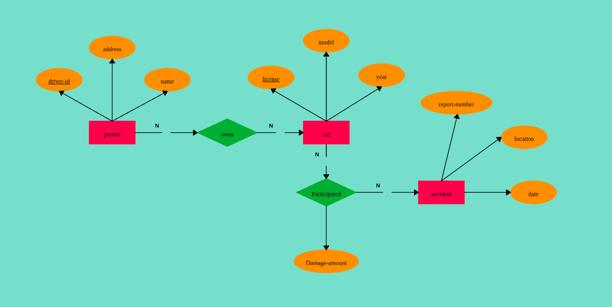

# Car Accident DBMS Simulator 🚙🔧💨



<p align="center"><em>ER diagram representing Car Accident DB</em></p>


## Overview

Car Crash DataBase Sim is a Python and Flask-based web application that simulates a car crash database. The application allows you to add, remove, and manage records for people, cars, and accidents using a MySQL backend. Records include details for persons, cars, and accident reports, which are linked together in the database.

## Project Structure

- **src/**  
  - **car_crash_DB/**  
    - **app.py** – Main application file launching the Flask server ([app.py](src/car_crash_DB/app.py)).
    - **entities/** – Contains the core classes:
      - [`Person`](src/car_crash_DB/entities/person.py) – Handles person records.
      - [`Car`](src/car_crash_DB/entities/car.py) – Manages car records and links them to accidents.
      - [`Accident`](src/car_crash_DB/entities/accident.py) – Represents accident records.
      - [`FileSystem`](src/car_crash_DB/entities/filesystem.py) – Manages the database connection, table creation, and cleanup.
      - `__init__.py` – Aggregates entity imports for simplified usage.
    - **templates/** – HTML templates for the application, including [`index.html`](src/car_crash_DB/templates/index.html).
    - **static/** – Contains static assets like [`style.css`](src/car_crash_DB/static/style.css).

- **tests/**  
  Unit tests ensure that all entities behave as expected:
  - [test_person.py](tests/test_person.py)
  - [test_car.py](tests/test_car.py)
  - [test_accident.py](tests/test_accident.py)
  - [test_filesystem.py](tests/test_filesystem.py)

- **docs/**  
  - [phpMyAdmin_setup.md](docs/phpMyAdmin_setup.md) – Step-by-step guide to set up phpMyAdmin for database management.

- **.env** – Environment file containing variables used for the MySQL connection.

- **requirements.txt** – Lists required Python packages.

- **LICENSE** – This project is licensed under the MIT License ([LICENSE](LICENSE)).

- **.gitignore** – Specifies file patterns to ignore in git.

## Getting Started

### Prerequisites

Ensure you have the following installed:
- Python 3.x
- MySQL Server
- [phpMyAdmin](docs/phpMyAdmin_setup.md) (optional, for database management)
- Apache2 and PHP (if using phpMyAdmin)
- `pip` for package management

### Installation

1. **Clone the Repository:**

    ```sh
    git clone https://github.com/yourusername/Car-Crash-DB.git
    cd Car-Crash-DB
    ```

2. **Create and Activate a Virtual Environment:**

    ```sh
    python -m venv venv
    source venv/bin/activate   # On Windows: venv\Scripts\activate
    ```

3. **Install Dependencies:**

    ```sh
    pip install -r requirements.txt
    ```

4. **Configure Environment Variables:**

    Update the database settings in the provided [`.env`](.env) file:

    ```
    MYSQL_HOST=__
    MYSQL_USER=__
    MYSQL_PASSWORD=__
    MYSQL_DB=__
    ```

5. **Database Setup:**

    The database and necessary tables (customers, cars, accidents, and car_accidents) are automatically created by the [`FileSystem`](src/car_crash_DB/entities/filesystem.py) class when the application runs.

### Running the Application

Start the Flask development server with:

```sh
python src/car_crash_DB/app.py
```

Then, open [http://localhost:5000](http://localhost:5000) in your browser to use the application.

## Running Tests

Execute unit tests from the root directory with:

```sh
python -m unittest discover tests
```

## Features

- **Add Records:** Input person, car, and accident details via a web form.
- **Remove Records:** Delete complete records using a driver ID. The removal process cascades through related tables.
- **View Data:** Displays comprehensive lists of customers, cars, and accidents.
- **Database Management:** Automatically manages MySQL database and table creation.
- **phpMyAdmin Integration:** Use [phpMyAdmin_setup.md](docs/phpMyAdmin_setup.md) for setting up and managing the database through a web interface.
- **Unit Tested:** Comprehensive tests available in the [tests](tests) directory verify key functionalities.

## Technologies Used

- **Backend:** Python, Flask, mysql-connector
- **Frontend:** HTML, CSS, with FontAwesome for icons
- **Database:** MySQL
- **Additional Tools:** dotenv for environment variable management, phpMyAdmin for managing MySQL

## License

This project is licensed under the MIT License – see the [LICENSE](LICENSE) file for details.

## Learn More

▶️ Check it out on [Youtube](https://youtu.be/0_Nwg2h4dlI)!\
<!-- 🧑‍💻 Read more about it on my [website](https://coltonblackwell.github.io/story_gen.html)! -->
